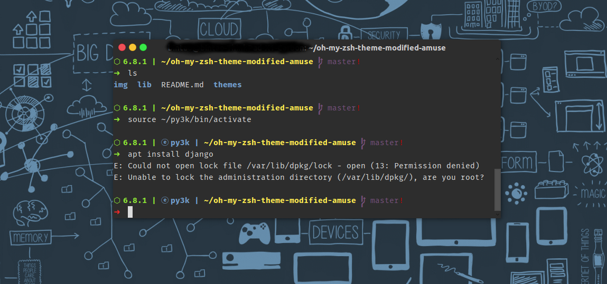

# My-zsh-theme
This is my oh-my-zsh theme.



### Usage:
Just copy these files to your `oh-my-zsh` custom folder
```shell
git clone git://github.com/dengbintao/my-zsh-theme
cp -rv my-zsh-theme/lib/ oh-my-zsh-theme-modified-amuse/themes/ $ZSH_CUSTOM
```
Next, edit your `.zshrc` file to use this theme:
```
ZSH_THEME="my-zsh-theme"
plugins=(git virtualenv)
```

Restart your zsh, theme will launch.
